# Architecture Diagram

```mermaid
flowchart TD

    %% ========================================================
    %% SOURCE AND STAGING
    %% ========================================================

    A[Source CSV<br/>Diabetes 130-US Hospitals]
    B[SQL Server Database<br/>Healthcare_Readmissions]
    C[Raw Imported Table<br/>dbo.raw_diabetes_readmissions]
    D[Cleaned Staging View<br/>dbo.stg_readmissions]

    A -->|CSV import| C
    B --- C
    C --> D

    %% ========================================================
    %% DIMENSIONAL MODELING
    %% ========================================================

    subgraph DM["Dimensional Modeling Layer"]
        E[dim_patient]
        F[dim_diagnosis]
        G[fact_readmissions]

        E -->|patient_nbr foreign key| G
    end

    D --> E
    D --> F
    D --> G

    %% ========================================================
    %% ANALYTICS VIEWS
    %% ========================================================

    subgraph AV["Business-Focused Analytics Views"]
        H[vw_readmission_by_age]
        I[vw_readmission_by_gender]
        J[vw_readmission_by_race]
        K[vw_readmission_by_los]
        L[vw_readmission_by_medications]
        M[vw_readmission_by_med_group]
        N[vw_readmission_by_med_change]
        O[vw_readmission_by_admission_type]
        P[vw_readmission_by_specialty]
        Q[vw_top10_specialty_readmission]
        R[vw_readmission_by_num_diagnoses]
        S[vw_readmission_by_complexity]
        T[vw_readmission_by_a1c]

        P --> Q
    end

    D --> H
    D --> I
    D --> J
    D --> K
    D --> L
    D --> M
    D --> N
    D --> O
    D --> P
    D --> R
    D --> S
    D --> T

    %% ========================================================
    %% STORED PROCEDURE
    %% ========================================================

    U[Stored Procedure<br/>dbo.usp_ReadmissionSummary]

    D --> U

    %% ========================================================
    %% POWER BI
    %% ========================================================

    subgraph BI["Power BI Reporting Layer"]
        V[Power BI Semantic Model<br/>Imported SQL Views, Staging Data<br/>and DAX Measures]
        W[Hospital Readmission Overview]
        X[Clinical Drivers of Readmission]
        Y[Patient Risk Factors]

        V --> W
        V --> X
        V --> Y
    end

    D --> V
    H --> V
    J --> V
    K --> V
    M --> V
    N --> V
    O --> V
    Q --> V
    S --> V

    %% ========================================================
    %% VALIDATION
    %% ========================================================

    Z[Validation Script<br/>06_Validation.sql]

    Z -. validates raw row count .-> C
    Z -. validates dimensions and fact .-> G
    Z -. validates stored procedure .-> U
    Z -. validates reporting outputs .-> H
    Z -. validates reporting outputs .-> Q
```

## Architecture Summary

1. `01_Create_Database.sql` creates the `Healthcare_Readmissions` SQL Server database.

2. The source CSV is imported into the raw table `dbo.raw_diabetes_readmissions`.

3. `02_Create_Staging_View.sql` creates `dbo.stg_readmissions`, which:
   - preserves the original imported table;
   - converts numeric fields to the appropriate data types;
   - creates the `readmitted_30d_flag` used throughout the analysis.

4. `03_Create_Dimensions_and_Fact.sql` creates the dimensional-modeling layer:
   - `dim_patient`;
   - `dim_diagnosis`;
   - `fact_readmissions`.

   `dim_patient` is related to `fact_readmissions` through `patient_nbr`.  
   `dim_diagnosis` is currently a standalone diagnosis reference table and is not linked to `fact_readmissions`.

5. `04_Create_Analytics_Views.sql` creates business-focused reporting views directly from `dbo.stg_readmissions`. These views calculate patient counts, readmitted-patient counts, and readmission rates across demographic, clinical, and treatment-related categories.

6. `dbo.vw_top10_specialty_readmission` is created from `dbo.vw_readmission_by_specialty`. The remaining analytics views are created directly from the staging view.

7. `05_Create_Stored_Procedure.sql` creates `dbo.usp_ReadmissionSummary`, which returns reusable executive KPIs:
   - total encounters;
   - readmitted encounters;
   - readmission rate;
   - average length of stay.

8. Power BI imports the required analytics views and staging data, adds DAX measures, and presents the analysis across three report pages:
   - Hospital Readmission Overview;
   - Clinical Drivers of Readmission;
   - Patient Risk Factors.

9. `06_Validation.sql` validates the raw dataset, dimensional-modeling objects, stored-procedure results, and principal analytics views.

## SQL Script Execution Order

1. `01_Create_Database.sql`
2. Import the source CSV as `dbo.raw_diabetes_readmissions`
3. `02_Create_Staging_View.sql`
4. `03_Create_Dimensions_and_Fact.sql`
5. `04_Create_Analytics_Views.sql`
6. `05_Create_Stored_Procedure.sql`
7. `06_Validation.sql`
