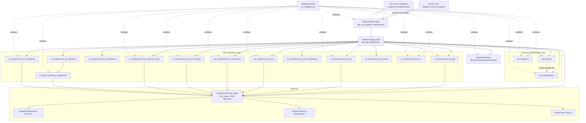

# Architecture Diagram

## Architecture Summary

1. The **Healthcare_Readmissions** database is created in SQL Server.
2. The source CSV is imported into `dbo.raw_diabetes_readmissions`.
3. `dbo.stg_readmissions` preserves the raw table while converting numeric fields and creating the 30-day readmission flag.
4. The staging view feeds two parallel SQL layers:
   - a dimensional model containing `dim_patient`, `dim_diagnosis`, and `fact_readmissions`;
   - business-focused analytics views used for readmission analysis.
5. `dbo.vw_top10_specialty_readmission` is generated from `dbo.vw_readmission_by_specialty`; the other analytics views are generated directly from `dbo.stg_readmissions`.
6. `dbo.usp_ReadmissionSummary` reads from the staging view and returns reusable executive KPIs.
7. Power BI imports the required analytics views and the staging view, adds DAX measures, and presents the results across three report pages.
8. `06_Validation.sql` verifies row counts, dimensional tables, stored-procedure output, and the principal analytics views.

## SQL Script Execution Order

1. `01_Create_Database.sql`
2. Import the source CSV as `dbo.raw_diabetes_readmissions`
3. `02_Create_Staging_View.sql`
4. `03_Create_Dimensions_and_Fact.sql`
5. `04_Create_Analytics_Views.sql`
6. `05_Create_Stored_Procedure.sql`
7. `06_Validation.sql`
