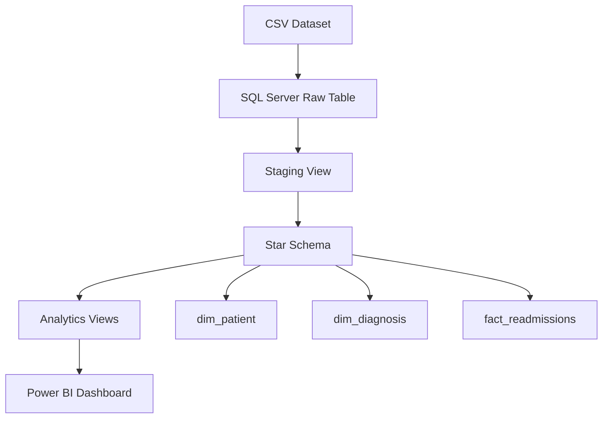

# Architecture Diagram

```mermaid
flowchart TD
    A[CSV Dataset] --> B[SQL Server Raw Table]
    B --> C[Staging View]
    C --> D[Star Schema]
    D --> E[Analytics Views]
    E --> F[Power BI Dashboard]

    D --> D1[dim_patient]
    D --> D2[dim_diagnosis]
    D --> D3[fact_readmissions]
```
