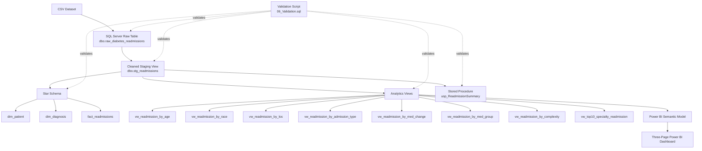

# Architecture Diagram

## Architecture Summary

The project uses a SQL-first analytics architecture:

1. The source CSV dataset is loaded into the SQL Server raw table `dbo.raw_diabetes_readmissions`.
2. The staging view `dbo.stg_readmissions` cleans and standardizes the raw data and creates the 30-day readmission flag.
3. A star schema containing `dim_patient`, `dim_diagnosis`, and `fact_readmissions` supports dimensional modeling and encounter-level analysis.
4. Business-focused analytics views are created directly from the staging layer.
5. Power BI consumes the analytics views through its semantic model and presents the results in a three-page dashboard.
6. The stored procedure `usp_ReadmissionSummary` provides reusable summary-level reporting.
7. `06_Validation.sql` validates the raw table, staging view, star schema, analytics views, and stored procedure.
