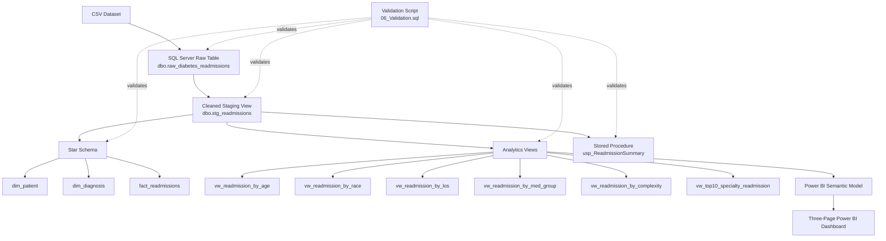

# Architecture Diagram

## Architecture Summary

The project uses a SQL-first analytics architecture.

1. The source CSV is imported into `dbo.raw_diabetes_readmissions`.
2. `dbo.stg_readmissions` standardizes data types and creates the 30-day readmission flag.
3. A star schema is created for dimensional-modeling practice and encounter-level analysis.
4. Business-focused analytics views are created directly from the staging layer and consumed by Power BI.
5. `usp_ReadmissionSummary` provides reusable executive KPIs.
6. `06_Validation.sql` verifies row counts, dimensional tables, analytics views, and stored-procedure results.
