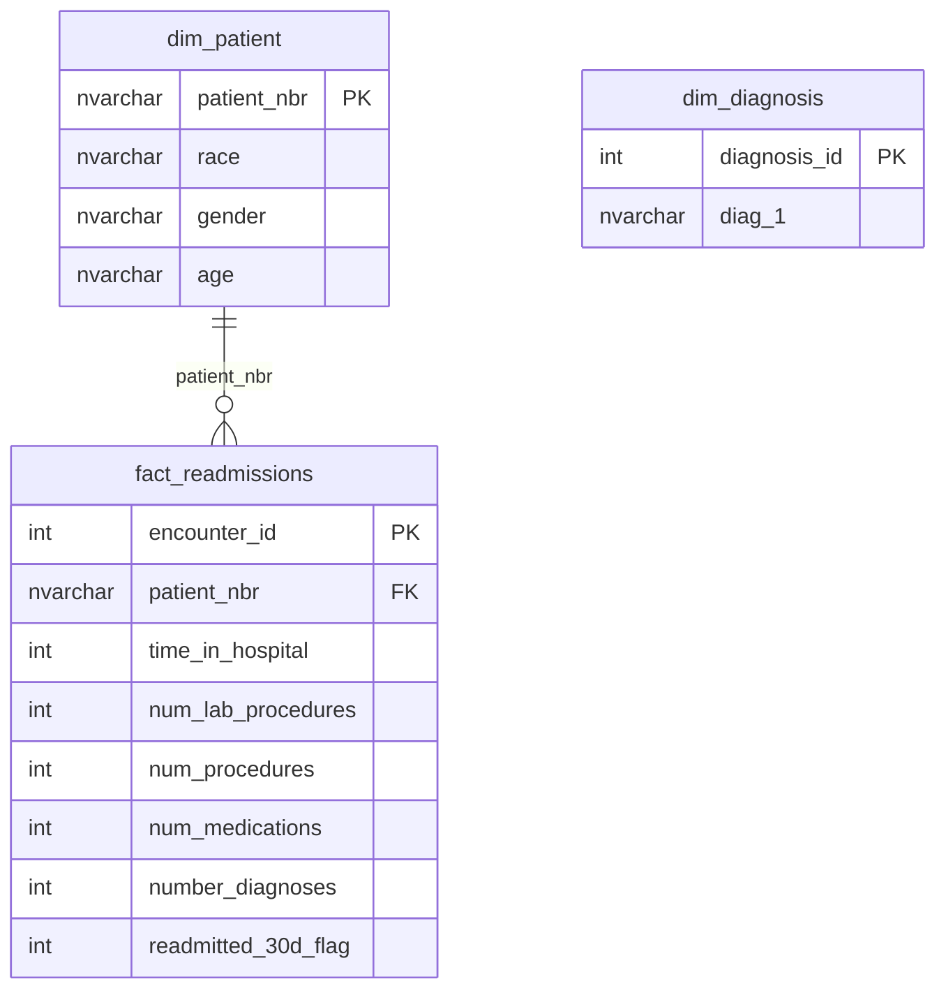

# ER Diagram

```mermaid
erDiagram
    dim_patient ||--o{ fact_readmissions : patient_nbr

    dim_patient {
        nvarchar patient_nbr PK
        nvarchar race
        nvarchar gender
        nvarchar age
    }

    fact_readmissions {
        int encounter_id PK
        nvarchar patient_nbr FK
        int time_in_hospital
        int num_lab_procedures
        int num_procedures
        int num_medications
        int number_diagnoses
        int readmitted_30d_flag
    }

    dim_diagnosis {
        int diagnosis_id PK
        nvarchar diag_1
    }
```
