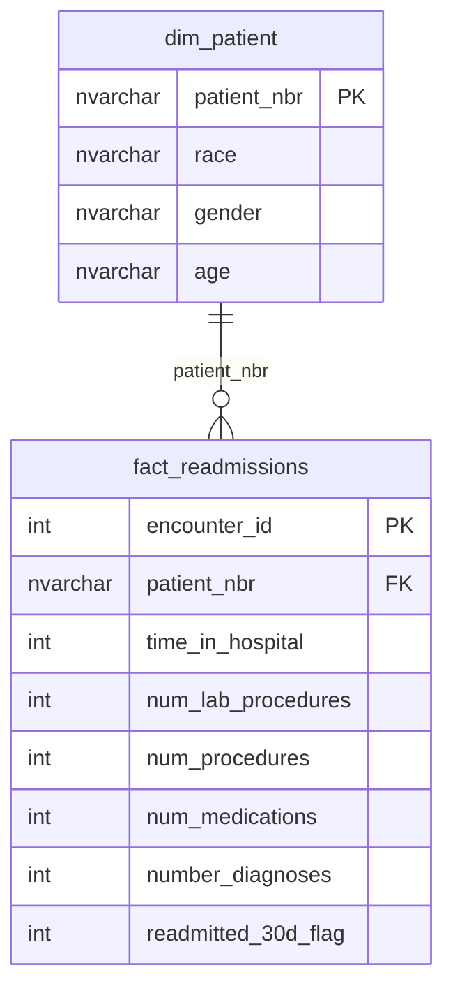

# ER Diagram

## Relationship Summary

- `dim_patient` contains one row per unique patient.
- `fact_readmissions` contains one row per hospital encounter.
- One patient can have multiple hospital encounters.
- `fact_readmissions.patient_nbr` is a foreign key referencing `dim_patient.patient_nbr`.

## Standalone Reference Table

The project also includes `dim_diagnosis`:

- `diagnosis_id` — primary key
- `diag_1` — unique primary diagnosis code

`dim_diagnosis` is not shown in the ER diagram because the current `fact_readmissions` table does not contain a `diagnosis_id` foreign key. It remains a standalone reference table that can be connected to the fact table in a future model enhancement.
