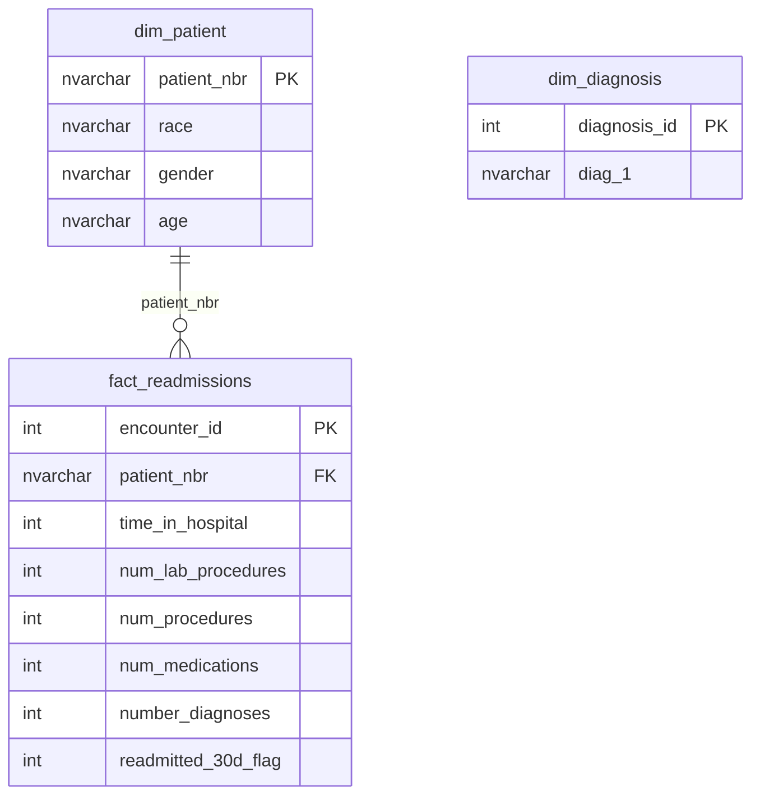

# ER Diagram

## Model Notes

- `dim_patient` contains one row per unique patient.
- `fact_readmissions` contains one row per hospital encounter.
- One patient can have multiple hospital encounters.
- `fact_readmissions.patient_nbr` is a foreign key referencing `dim_patient.patient_nbr`.
- `dim_diagnosis` contains unique primary diagnosis codes.
- `dim_diagnosis` is currently a standalone reference table because `fact_readmissions` does not contain a `diagnosis_id` foreign key.
