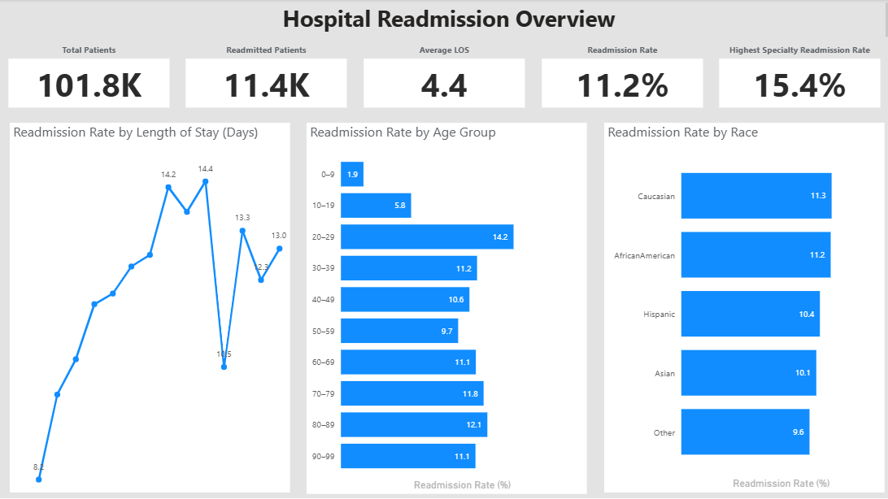
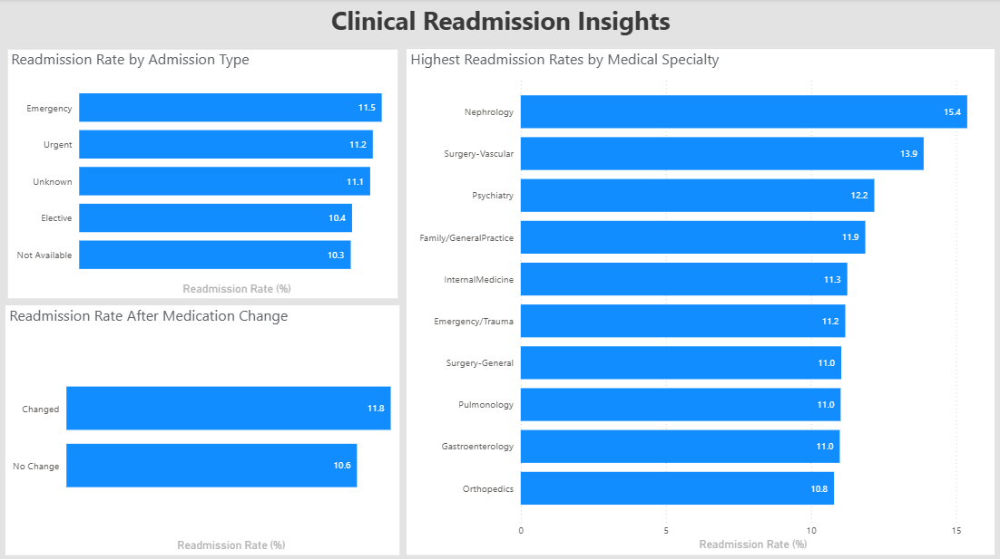
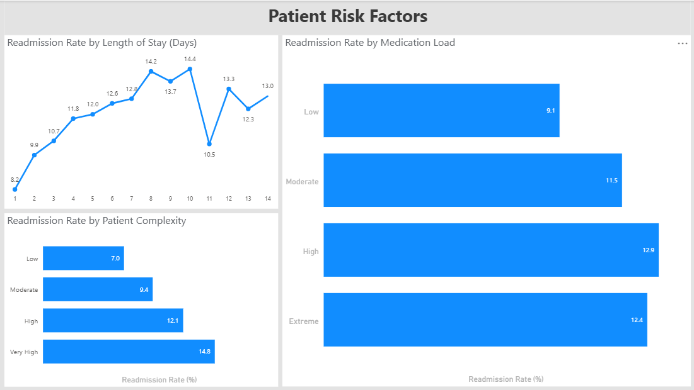

# Hospital Readmission Analytics

A SQL Server and Power BI project analyzing hospital readmissions, patient risk factors, and clinical patterns across **101,766 inpatient encounters**.

---

## Project Overview

---

## Project Overview

Hospital readmissions are an important quality and performance metric in healthcare. Understanding which patient populations and clinical characteristics are associated with higher readmission rates can help hospitals improve patient outcomes, optimize care planning, and reduce avoidable healthcare costs.

This project demonstrates an end-to-end healthcare analytics workflow using **SQL Server** and **Power BI**. Raw hospital encounter data was transformed into analytical SQL views, validated, and visualized through an interactive three-page dashboard designed to support executive and clinical decision-making.

The analysis focuses on identifying patterns in 30-day hospital readmissions across demographic, clinical, and treatment-related factors.

---

## Business Problem

Hospital administrators and clinical teams need reliable analytics to understand why patients are readmitted and which factors contribute most to higher readmission rates.

This project answers key business questions, including:

- What is the overall 30-day hospital readmission rate?
- Which patient groups experience the highest readmission rates?
- How does length of stay influence readmission risk?
- How do medication burden and medication changes affect readmissions?
- Which admission types and medical specialties have the highest readmission rates?
- Which patient risk factors should receive the greatest clinical attention?

The resulting dashboard provides a concise executive overview together with detailed clinical insights to support data-driven healthcare decisions.

---

## Dataset

- **Domain:** Healthcare
- **Dataset:** Hospital Readmission (Diabetes 130-US Hospitals)
- **Total Records:** **101,766** inpatient encounters
- **Database:** Microsoft SQL Server
- **Visualization:** Microsoft Power BI

The dataset contains demographic, clinical, medication, and hospitalization information used to analyze factors associated with 30-day hospital readmissions.

---

## Dashboard Preview

### Hospital Readmission Overview

### Clinical Drivers of Readmission

### Patient Risk Factors

